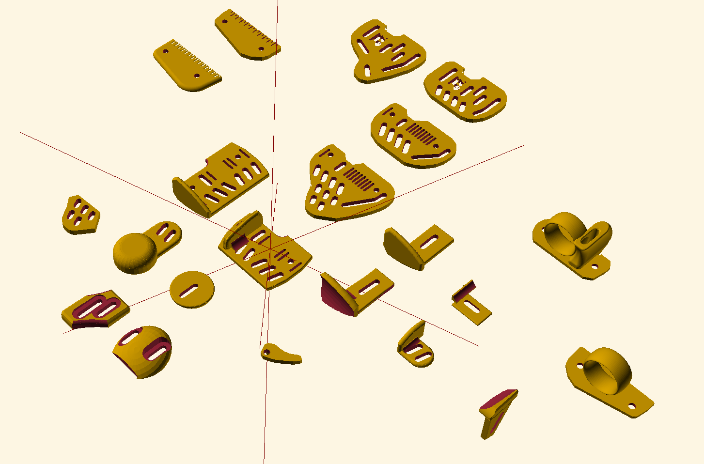

# Tab's Libretab

This is an OpenSCAD model to create various styles of Archery Tabs and attachments.

It is designed to be scalable based on the hand size of the archer.

This has also been a learning curve for me to learn OpenSCAD. As such, some of the earlier tab shapes are not as scalable.

There will also be limit where if you scale too small, you may have to remove some of the holes as they'll overlap with the 
edge of object.

Please feel free to submit PRs for your mods or additions.

## Assembly
You will need some:

* M4 bolts and nuts (I use dome nuts so that there are no rough bolt edges). You can easily change the size of bolts in the settings at the top of the file.

* Tab leather (take from your current tab?). There ia also a UK seller of small squares of cordovan for around 12GBP available on the leading auction site.

* a finger spacer. There are plenty of spacers available for download on stl sites.

I recommend washers to give it a little more strength, although I've not had any break on me without either.

## Here are the currently avialable items

## Assembled Tab

Here is an assembled version with chin plate, pinky trigger and palm plate, many more combinations possible

